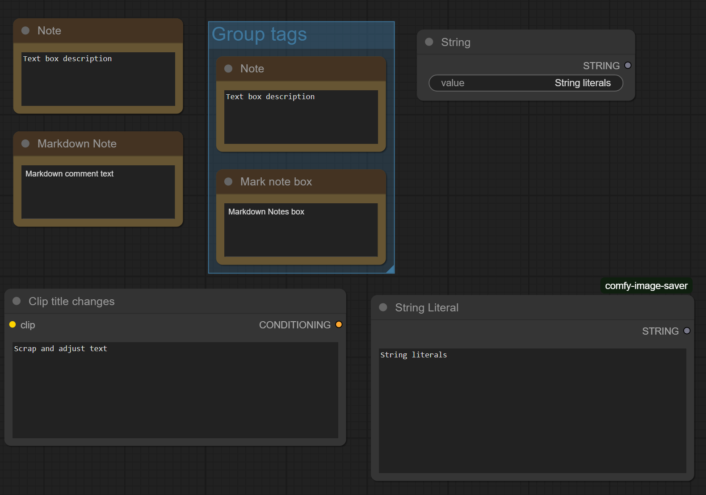
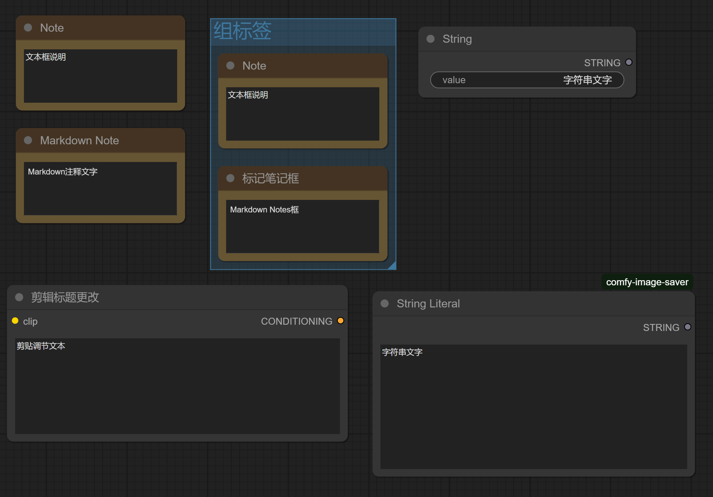
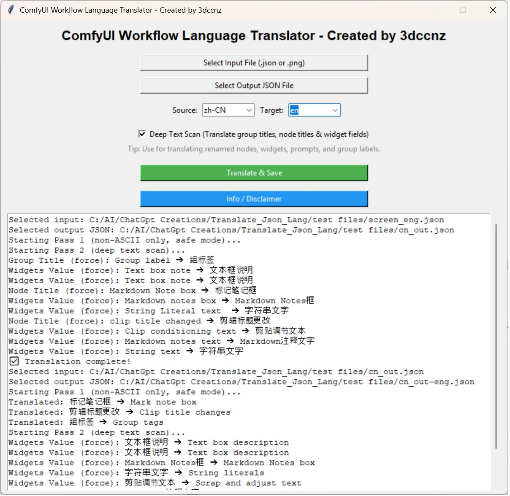
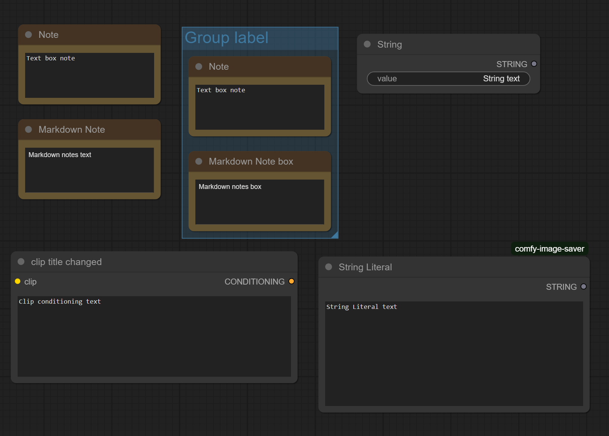

# ComfyUI Workflow Language Translator 
(Standalone Program - Not a Comfyui Node "Yet")

**Created by 3dccnz** 

---

## 🚀 What is this?

The ComfyUI Workflow Language Translator allows you to safely and automatically translate entire ComfyUI workflows (.json or embedded .png files) between languages.

✅ Supports most common fields  
✅ Safe translation using multiple passes  
✅ Fully GUI-based (no coding required)  
✅ Can export clean JSON files after translating PNG workflows

---

## 🔧 Key Features

- Dual-pass translation engine:
  - Safe mode for non-ASCII fields.
  - Deep Text Scan mode for group titles, node titles, widget fields, prompts.
- Supports:
  - `.json` ComfyUI workflows
  - `.png` ComfyUI workflows (embedded JSON)
- Uses Google Translate (via `deep-translator`) with no API key required.
- Fully standalone EXE available.

---

## 📸 Translation Example

### English Workflow

### Translated into Chinese

### Translator Tool In Action

### Back-translated into English

---

## ⚠ Disclaimer

- Not guaranteed to translate 100% of all workflow fields.
- Some nodes with custom configurations may fail or partially translate.
- Always test translated workflows before production use.

## 📦 Download EXE

👉 [Download latest EXE release](https://github.com/3dccnz/comfyui-workflow-language-translator/releases/latest)

The EXE version is fully standalone — no Python required.

---

## 🖥 How to Run (Python version)

1️⃣ Clone repo
git clone https://github.com/your-repo-url/comfyui-workflow-language-translator.git

cd comfyui-workflow-language-translator

2️⃣ Create isolated environment (recommended but not required)
python -m venv venv

Activate venv:

On Windows:
venv\Scripts\activate

On Mac/Linux:
source venv/bin/activate

3️⃣ Install requirements
pip install -r requirements.txt

4️⃣ Run the translator
python comfyui_translator.py

## 🔨 How to Build a Standalone EXE (PyInstaller build)
This creates a fully standalone, portable EXE version.

1️⃣ Inside your activated virtual environment, install PyInstaller:
pip install pyinstaller

2️⃣ Build EXE:
pyinstaller --onefile --noconsole comfyui_translator.py
--onefile bundles everything into a single EXE.

--noconsole disables the black console window on launch.

3️⃣ Your EXE will appear here:
/dist/comfyui_translator.exe

You can copy this EXE anywhere — Python is no longer required.
